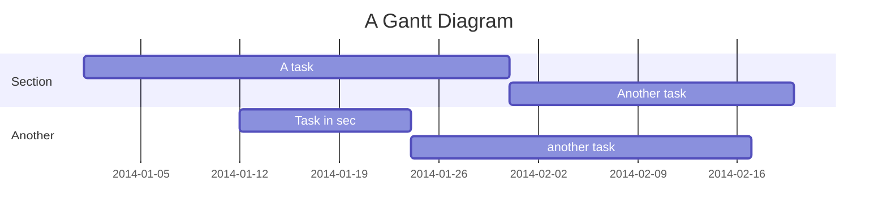

# This is a large heading

## This is a smaller heading

And as **imagination** bodies forth,
The forms of things *unknown*, the poet’s pen,
Turns them to shapes and gives to airy nothing,
A local *habitation* and a **name**.

- This is
- an unordered
- list

1. This is
2. an ordered
3. list

Here is `some code` in the middle of a sentence.

```
This is
a block
of code
```


